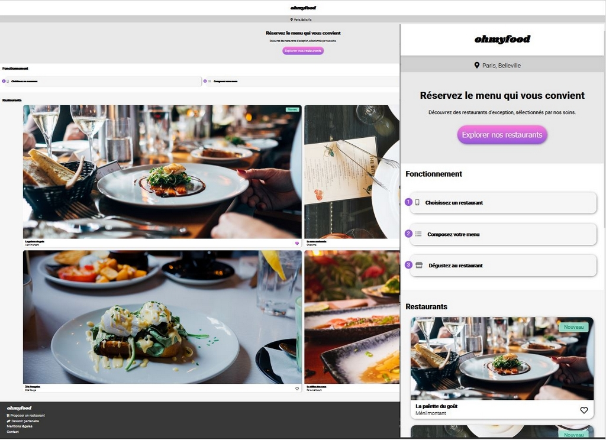

# ohmyfood

--------

Troisième projet du parcours "Développeur web" chez Openclassrooms.  
Intégrer puis dynamiser une page web avec des animations CSS en utilisant le préprocesseur Sass.

## Objectifs:
--------
1. Développer un site proposant le menu de 4 grands restaurants parisiens.
2. Permettre la réservation en ligne et la composition de son menus.

## Livrables:
--------

### Pages à intégrer selon les maquettes:
* Page d'accueil
* Pages de menu (x4)

### Animation:

### Boutons
* Au survol, la couleur de fond des boutons principaux devra légèrement s'éclaircir.  
L'ombre portée devra également être plus visible.

